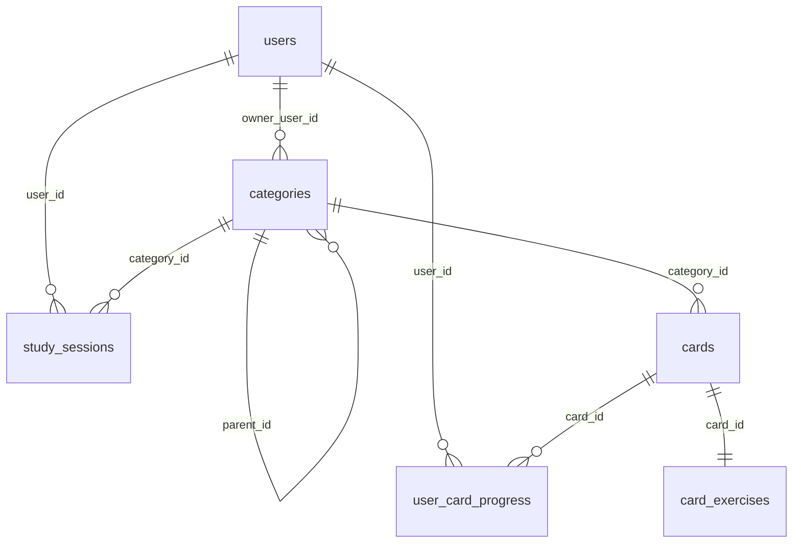

# Technik der Lernkartei

Diese Datei erklärt, wie das Projekt technisch funktioniert: aus welchen Teilen es
besteht, was beim Aufruf einer Seite passiert und wie der Lernstoff verwaltet
wird. Sie ist für Mitstudierende und für neue Entwickler geschrieben, die den Code
zum ersten Mal sehen.

Alles hier steht so im Code. Wo ich etwas nicht sicher prüfen konnte, steht das
ausdrücklich dabei (siehe auch Abschnitt 10).

Die kurze Startanleitung steht in `README.md`, die Regeln für die Zusammenarbeit in
`.github/copilot-instructions.md`.

---

## 1. Überblick

### 1.1 Was die Anwendung macht

Die Lernkartei ist eine Web-Anwendung zum Vokabeln- und Fachbegriffe-Lernen mit
Karteikarten. Alle Nutzer teilen sich **einen** Kartenbestand, aber jeder Nutzer
hat seinen **eigenen** Lernfortschritt pro Karte. Der Inhalt ist in drei Ebenen
gegliedert:

```
Lernbereich (z. B. "Energy")
   └── Unterkategorie (z. B. "Power grid and transmission")
          └── Karteikarte (Vorderseite / Rückseite, optional beidseitig lernbar)
```

Es gibt vier Ansichten, die sich eine Seite teilen:

1. **Startseite** (`index.php`) – die Lernbereiche als Kachelreihe.
2. **Bereichsseite** (`index.php?category=3`) – die Unterkategorien als Zeilen.
3. **Unterkategorie-Seite** (`index.php?category=101`) – die Kartenliste mit Suche,
   drei Kennzahlen-Kacheln und dem Lernen-Knopf.
4. **Lernansicht** – ein Vollbild in derselben Seite: Karte umdrehen, mit
   1–4 bewerten, am Ende die Zusammenfassung.

Dazu kommen Dialoge für Anlegen, Bearbeiten und Löschen, ein CSV-Import und die
Anmeldung.

### 1.2 Technik auf einen Blick

| Bereich | Was genau | Anmerkung |
| --- | --- | --- |
| Sprache Backend | PHP **8.5.4** (geprüft mit `php -v`) | kein Framework, keine Klassen, nur Funktionen |
| Datenbank | MySQL/MariaDB **8.4.11** (Ubuntu-Paket) | Datenbank `learning_app`, Zeichensatz `utf8mb4` |
| Datenbankzugriff | PDO mit Prepared Statements | `ERRMODE_EXCEPTION`, `FETCH_ASSOC`, `EMULATE_PREPARES = false` |
| Frontend | HTML, CSS und reines JavaScript | kein React/Vue/jQuery, kein TypeScript |
| Bauwerkzeuge | **keine** | es gibt kein `composer.json`, kein `package.json`, kein `node_modules` und keinen Bauschritt |
| Server (Entwicklung) | PHP-eigener Server (`php -S`), 4 Worker | gestartet über `./start-dev.sh` |
| Server (Produktion) | Apache mit `public/` als DocumentRoot | `deploy/apache/learning-app.conf` |
| Betriebssystem | Windows mit **WSL2/Ubuntu** | siehe Abschnitt 3 |
| Versionierung | Git, Branch `main`, Remote `origin` | 88 Commits, `github.com:pachama-ai/learning-app.git` |
| Auslieferung | Dateien werden 1:1 ausgeliefert | keine Kompilierung, kein Bundling |

Die Dateien werden also so ausgeliefert, wie sie im Editor stehen. Wenn man eine
CSS-Zeile ändert und die Seite neu lädt, ist die Änderung sofort da (bei CSS und
JavaScript sorgt `asset_url()` mit `?v=<Änderungszeit>` dafür, dass der Browser
nicht die alte Fassung aus dem Zwischenspeicher benutzt).

### 1.3 Wie die Teile zusammenspielen

```
Browser (HTML + CSS + JavaScript)
   │  fetch() → JSON
   ▼
public/               ← das Einzige, was der Webserver ausliefert
   ├── index.php      baut die HTML-Hülle, berührt die Datenbank nicht
   └── api/*.php      ein Endpunkt pro Datei: prüfen → Service → JSON
   ▼
src/                  ← liegt außerhalb des Web-Roots, ist per URL nicht erreichbar
   ├── helpers/       kleine Funktionen (JSON-Antwort, Eingabeprüfung, Sprachen, .env lesen)
   ├── services/      Fachlogik und ALLE SQL-Abfragen
   └── config/        baut die Datenbankverbindung; die Werte kommen aus .env
   ▼
MySQL/MariaDB (Datenbank learning_app)
```

```
.env                  ← im Projektstamm, ebenfalls außerhalb des Web-Roots
   (DB_HOST, DB_PORT, DB_NAME, DB_USER, DB_PASS, DB_CHARSET)
```

Zwei Regeln erklären fast den ganzen Aufbau:

* **Der Browser spricht nie mit der Datenbank.** Er kennt nur die JSON-Endpunkte.
* **SQL steht nur in `src/services/`.** Eine Ausnahme gibt es: `public/api/`
  `category_icon.php` liest sein SVG selbst (ebenfalls als Prepared Statement),
  weil es die Datei direkt ausliefern muss statt JSON.

---

## 2. Ablauf einer Anfrage: `index.php?category=3`

`category=3` ist der Lernbereich „Energy“, hat also Unterkategorien und keine
eigenen Karten. Schritt für Schritt:

**Schritt 1 – Browser.** Der Browser fragt `http://127.0.0.1:8081/index.php?category=3`.
Es gibt keine Rewrite-Regeln, die Adresse entspricht genau einer Datei.

**Schritt 2 – Webserver.** Entweder der PHP-Entwicklungsserver (`php -S … -t public`)
oder Apache mit `public/` als DocumentRoot. Ausgeliefert wird nur, was unter
`public/` liegt.

**Schritt 3 – `public/index.php`.** Die Datei liest zuerst `$_GET['category']` und
prüft sie hart: nur Ziffern und größer als 0, sonst bleibt der Wert `null`
(Startseite). Danach bindet sie drei Dateien ein (`helpers/html.php`,
`helpers/translations.php`, `services/exercise_service.php`), holt sich alle
Übersetzungen und baut ein Konfigurations-Array `$appConfig`. Darin stehen die
Endpunkt-Adressen, die Speicherschlüssel, die Grenzwerte (Name 100 Zeichen,
Kartentext 2000, Icon 358400 Bytes, Import 1 MB/5000 Zeilen), die drei Landkarten,
die Übungstypen, die 16 Bundesländer, die Sprachen und die Übersetzungen.

**Schritt 4 – HTML-Hülle.** `index.php` schreibt die Seite: Kopf, Kopfzeile,
beide Ansichten (`#view-home`, `#view-detail`), Dialoge, Lernansicht, Fußzeile.
Alle sichtbaren Texte kommen über `t('schlüssel')` beziehungsweise über
`data-i18n`-Attribute, nie als feste Zeichenkette. Ganz unten steht
`<script type="application/json" id="app-config">` mit dem `$appConfig` und
darunter `<script src="assets/js/app.js?v=…">`. **`index.php` macht keine einzige
Datenbankabfrage** – die Seite ist auch ohne Datenbank aufrufbar, sie bleibt dann
leer.

**Schritt 5 – Thema vor dem ersten Bild.** Ein kurzes Inline-Skript im `<head>`
liest `localStorage['lernkartei.theme']` und setzt sofort `data-theme` am
`<html>`. Dadurch erscheint die Seite nie kurz im falschen Thema. Ein zweites
Skript blendet das Ladebild (`#boot-overlay`, gestaltet in `boot.css`) ein und
wieder aus.

**Schritt 6 – `assets/js/app.js` liest seine Konfiguration.** Ganz am Anfang liest
das Skript den JSON-Block aus Schritt 4. Daraus entstehen `config.categoryId`
(= 3), `config.endpoints`, `config.limits`, die Übersetzungen und die Sprache
(`lernkartei.language`, Standard `en`).

**Schritt 7 – ein Sammelaufruf statt vieler.** `init()` setzt das Thema, wendet
die Sprache an und ruft `loadBootstrap()`. Das ist **eine** Anfrage:

```
GET api/bootstrap.php?language=de
```

`api/bootstrap.php` prüft die Methode (nur GET), liest die Sprache, holt über
`current_user_id()` den angemeldeten Nutzer und antwortet mit einem Bündel:

| Feld | Inhalt |
| --- | --- |
| `areas` | alle Lernbereiche |
| `children` | die Unterkategorien, gruppiert nach Bereichs-Id |
| `cards` | alle Karten nach Kategorie-Id, mit Fortschritt |
| `summaries` | Zählungen (neu/unsicher/gewusst/fällig) je Kategorie |
| `streak`, `streaks` | Serie in Tagen, gesamt und je Unterkategorie |
| `has_user` | ist jemand angemeldet? |
| `content_languages` | welche Sprachspalten die Tabelle wirklich hat |
| `language` | die benutzte Sprache |

Aus Sicht der Datenbank läuft dabei in den Services genau das:

1. `find_main_categories()` → `SELECT … FROM categories WHERE parent_id IS NULL …`
2. `find_subcategories()` für den Baum
3. `review_cards_all_categories()` → **eine** Abfrage über alle Karten mit einem
   `LEFT JOIN` auf `user_card_progress` (statt einer Abfrage pro Unterkategorie)
4. `dashboard_streak()` / `dashboard_streaks_by_category()` → die Tages-Serie aus
   `study_sessions`

Die Antwort wird in `bootstrapCache` im Speicher des Browsers abgelegt.

**Schritt 8 – Zeichnen.** `renderDetail(3)` fragt vier Dinge gleichzeitig ab
(`Promise.all`): alle Bereiche (für die Sidebar), die Kategorie selbst, ihre
Unterkategorien und ihre Karten. Weil die Antwort aus Schritt 7 schon im Cache
liegt, laufen diese vier in der Regel **ohne** neue Netzwerk-Anfrage durch; nur
was der Sammelaufruf nicht abdeckte, geht wirklich raus. Aus den Daten entstehen
Sidebar, Brotkrumen, Kopfzone, Kennzahlen und die Zeilen.

**Schritt 9 – Bilder.** Für jedes Icon steht in der Antwort nur `icon_url`
(`api/category_icon.php?id=3&v=<Fingerabdruck>`). Der Browser lädt das SVG einmal
und behält es (`Cache-Control: immutable`). Große SVG-Dateien werden also nie in
eine Listen-Antwort eingebettet.

### Welche Anfragen eine Seite wirklich macht

| Anfrage | Wann | Antwort |
| --- | --- | --- |
| `GET api/bootstrap.php?language=…` | einmal pro Seitenaufbau | das Bündel aus Schritt 7 |
| `GET api/category_icon.php?id=N&v=…` | pro Icon, einmal pro Browser-Sitzung | SVG, oder `304` wenn unverändert |
| `GET api/auth.php` | beim Start, wenn kein Nutzer bekannt ist | `{user, ready, csrf_token}` |
| `GET api/cards.php?category_id=N` | nur wenn der Cache die Kategorie nicht kennt | Karten + Zusammenfassung + Serie |
| `POST api/review.php` | beim Bewerten, Zurücknehmen, Beenden | neuer Fortschritt |
| `POST api/cards.php`, `PATCH api/card.php`, `PATCH/DELETE api/category.php` | beim Speichern/Löschen | die gespeicherte Zeile |
| `POST api/import_cards.php` | beim CSV-Import (multipart) | Prüfergebnis oder Anzahl |
| `GET assets/maps/*.svg`, `assets/samples/*.csv` | wenn eine Karte eine Region hat bzw. auf Wunsch | statische Datei |

### Und der Weg zurück

Eine Schreib-Anfrage läuft genau andersherum: `app.js` schickt JSON an einen
Endpunkt → der Endpunkt prüft Methode und Felder (`src/helpers/request_input.php`)
→ er ruft eine Service-Funktion → die Service-Funktion schreibt per Prepared
Statement in die Datenbank und gibt die gespeicherte Zeile zurück → der Endpunkt
verpackt sie mit `send_json_success()` in `{"success":true,"data":…}` → der
Browser lädt die Liste aus dem Sammelaufruf neu und zeichnet sie. Der Browser
rechnet nie selbst einen Fälligkeitstermin aus, er zeigt nur, was zurückkam.

---

## 3. WSL

### 3.1 Was WSL ist

**WSL** heißt *Windows Subsystem for Linux*. Es ist eine Funktion von Windows, mit
der man ein echtes Linux (hier Ubuntu) als Unterbau startet, ohne einen zweiten
Rechner oder eine virtuelle Maschine mit eigenem Fenster zu betreiben. Man
arbeitet in einem Linux-Terminal, und die Linux-Dateien liegen im Windows-Pfad
`\\wsl.localhost\Ubuntu\…`.

In dieser Version (WSL2) läuft Linux in einer kleinen virtuellen Maschine, die
Windows selbst verwaltet. Deshalb teilen sich Windows und Linux **das
localhost-Netz**: ein Server, der im Linux auf `127.0.0.1:8081` lauscht, ist im
Windows-Browser unter `http://127.0.0.1:8081/` erreichbar. Genau darauf beruht die
Arbeitsweise dieses Projekts.

### 3.2 Welche Rolle WSL in diesem Projekt spielt

| Aufgabe | Womit | Warum unter Linux |
| --- | --- | --- |
| Webserver starten | `./start-dev.sh` (bash + `php -S`) | Das Skript ist ein Shell-Skript; PHP und Apache sind Linux-Pakete |
| Datenbank | MySQL/MariaDB als Linux-Dienst | Zugang über `mysql://localhost`, Anmeldung in phpMyAdmin |
| Skripte | `bin/*.php` auf der Kommandozeile | sie brauchen PHP mit CLI und die Datenbankverbindung |
| Projektdateien | `/home/user/projects/learning-app` | liegt im Linux-Dateisystem (schneller als `/mnt/c`) |
| Editor | VS Code, geöffnet über *Remote – WSL* oder als `\\wsl.localhost\…` | siehe `.vscode/settings.json` |

Der Windows-Teil ist also nur Browser und Editor, die eigentliche Anwendung läuft
komplett im Linux.

### 3.3 Gibt es Dateien oder Skripte mit „wsl“ im Namen?

**Nein.** Im Projekt gibt es keine Datei, keinen Ordner und kein Skript mit `wsl`
im Namen (geprüft mit einer Suche über das ganze Repository). WSL kommt nur an
diesen drei Stellen vor:

| Stelle | Bedeutung |
| --- | --- |
| `docs/development-environment.md` | die Anleitung zum WSL-Aufbau und zum „WSL: Disconnected“-Problem |
| `.vscode/settings.json` | erklärt, warum die PHP-Prüfung in VS Code aus ist: der Ordner ist über `\\wsl.localhost\…` geöffnet, VS Code sucht PHP dann unter Windows und findet keins. Geprüft wird stattdessen mit `php -l` im Linux-Terminal |
| `README.md` / diese Datei | Hinweise darauf, dass im Linux gearbeitet wird |

Was man stattdessen braucht, sind die zwei Startskripte:

| Skript | Was es tut |
| --- | --- |
| `start-dev.sh` | startet `php -S 127.0.0.1:8081 -t public` mit `PHP_CLI_SERVER_WORKERS=4`. Port über `PORT=8082 ./start-dev.sh` änderbar |
| `start-apache.sh` | startet eine **eigene** Apache-Instanz auf Port 8082 mit `deploy/apache/httpd-user.conf` – ohne `sudo`, ohne den System-Apache (Port 80) anzufassen. Der System-Apache würde `www-data` heißen und dürfte nicht in `/home/user` hineinschauen |

Beide Skripte sind reine bash-Skripte und laufen nur unter Linux – das ist der
praktische Grund, warum das Projekt in WSL liegt.

### 3.4 Wenn „WSL: Disconnected“ erscheint

Diese Meldung ist **kein Fehler der Anwendung**: Wenn Windows in den Standby geht,
wird die WSL2-Maschine angehalten, und VS Code verliert die Verbindung. Die
Ursache, der `powercfg`-Befehl zum Abschalten der Standby-Zeit und die Diagnose
stehen ausführlich in `docs/development-environment.md`.

---

## 4. Ordnerstruktur

| Ordner | Wofür er da ist |
| --- | --- |
| `public/` | Das **einzige** Verzeichnis, das der Webserver ausliefert. Hier liegen die HTML-Hülle, die JSON-Endpunkte und alle Assets. Zugangsdaten dürfen hier nie liegen. |
| `public/api/` | Ein Endpunkt pro Datei, jeweils dünn: Methode prüfen → Felder prüfen → Service aufrufen → JSON senden. |
| `public/assets/css/` | `app.css` (das ganze Design) und `boot.css` (nur der Ladebildschirm). |
| `public/assets/js/` | `app.js` – das gesamte Frontend, eine einzige Datei. |
| `public/assets/fonts/` | Die selbst gehostete Schriftdatei Inter Tight (eine Variable-Font-Datei). |
| `public/assets/icons/` | Favicon und ein einzelnes SVG; die Bereichs-Symbole liegen in der Datenbank. |
| `public/assets/maps/` | Drei SVG-Landkarten (Deutschland, Europa, Welt) für Karten mit `map_region`. |
| `public/assets/samples/` | Die Beispiel-CSV, die der Import-Dialog anbietet. |
| `src/config/` | Baut die Verbindung zur Datenbank. Die Werte selbst stehen **nicht** hier, sondern in der Datei `.env` im Projektstamm. |
| `src/helpers/` | Kleine, zustandslose Funktionen: JSON-Antworten, Eingabeprüfung, SVG-Prüfung, Sprache, HTML-Escaping. |
| `src/services/` | Die Fachlogik und **alle** SQL-Abfragen: Kategorien, Karten, Lernen, Serie, Benutzer, Import, Übungsaufgaben. |
| `bin/` | Drei Kommandozeilen-Skripte für CSV-Importe. Sie liegen außerhalb des Web-Roots und sind per URL nicht erreichbar. |
| `database/` | SQL-Dateien, die **von Hand** in phpMyAdmin ausgeführt werden (Struktur-Änderungen), plus `database/import/` mit den CSV-Quelldateien. |
| `deploy/apache/` | Konfigurationen für Apache (eine für den System-Apache, eine für die eigene Instanz auf Port 8082). `logs/` und `sessions/` sind Laufzeitdaten und nicht im Git. |
| `docs/` | Diese Datei, die Prüfanleitung, die Migrationsliste und die Umgebungsnotizen. |
| `.github/` | `copilot-instructions.md` – die verbindlichen Regeln für Änderungen. |
| `.vscode/` | Editor-Einstellungen (nicht im Git). |

---

## 5. Klassen und wichtige Dateien

**Wichtig vorab: Es gibt im ganzen Projekt keine einzige Klasse.** Der Code ist
durchgehend prozedural – Funktionen und Konstanten, keine Objektorientierung,
kein Autoloader, kein Namespace, kein Composer. Wer eine Klasse sucht, findet
keine; wer eine anlegt, sollte das absprechen.

Von 34 PHP-Dateien beginnen alle 34 mit `declare(strict_types=1)`.

### 5.1 Die Endpunkte in `public/api/`

Alle Endpunkte antworten mit demselben Umschlag:
`{"success":true,"data":…}` oder `{"success":false,"error":{"code":…,"message":…}}`
(`src/helpers/json_response.php`).

| Datei | Methoden | Aufgabe | Wichtige Parameter |
| --- | --- | --- | --- |
| `health.php` | GET | prüft, ob die Datenbank erreichbar ist | – |
| `bootstrap.php` | GET | das Sammelbündel für den Seitenaufbau | `language` |
| `categories.php` | GET, POST | Bereiche/Unterkategorien lesen, Kategorie anlegen | `id`, `parent_id` |
| `category.php` | PATCH, DELETE | Kategorie ändern oder ganzen Teilbaum löschen | `id`, `confirm` |
| `category_icon.php` | GET, HEAD | das gespeicherte SVG ausliefern (mit `ETag`, `304`) | `id` |
| `cards.php` | GET, POST | Karten einer Kategorie mit Fortschritt; Karte anlegen | `category_id`, `language` |
| `card.php` | PATCH, DELETE | Karte ändern oder löschen | `id` |
| `review.php` | GET, POST | Lern-Sitzung: Warteschlange holen, bewerten, zurücknehmen, beenden | `category_id`, `mode`, `action`, `rating`, `session_id` |
| `import_cards.php` | POST | CSV prüfen (`mode=preview`) oder importieren (`mode=import`) | `file`, `category_id`, `mode` |
| `auth.php` | GET, POST | Sitzungsstatus; anmelden, registrieren, abmelden | `action`, `identifier`, `password`, `csrf_token` |
| `account.php` | POST | Konto löschen (mit Passwort und CSRF-Token) | `action`, `password`, `csrf_token` |
| `exercise_preview.php` | POST | ein Beispiel einer generierten Aufgabe bauen | `exercise_type`, `exercise_params` oder `items` |

### 5.2 Die Helfer in `src/helpers/`

| Datei | Aufgabe | Wichtigste Funktionen | Genutzt von |
| --- | --- | --- | --- |
| `json_response.php` | JSON senden, Header setzen, Request beenden | `send_json()`, `send_json_success()`, `send_json_error()` | allen Endpunkten |
| `request_input.php` | Werte aus Body und Query prüfen; bricht bei Fehlern sofort mit Fehler-JSON ab | `read_json_object()`, `require_input_text()`, `optional_input_text()`, `optional_positive_id()`, `optional_flag()`, `optional_svg_icon()`, `optional_icon_scale()`, `require_query_id()`, `optional_query_language()` | allen schreibenden Endpunkten |
| `session_user.php` | wer gerade angemeldet ist; startet die PHP-Sitzung sicher (`httponly`, `samesite=Lax`, `use_strict_mode`) | `current_user_id()`, `session_user_exists()`, `session_user_required_error()` | fast allen Endpunkten; `user_service.php` |
| `svg_sanitizer.php` | SVG-Dateien entschärfen (echter XML-Parser, keine Textmuster) | `svg_sanitize()`, `svg_clean_element()`, `svg_use_points_inside()` | `request_input.php` |
| `translations.php` | alle Texte in Englisch und Deutsch | `learning_app_translations()`, `t()`, `t_fill()` | `index.php`, `app.js` (als JSON), Übungsaufgaben |
| `html.php` | HTML sicher ausgeben und Assets versionieren | `escape_html()`, `asset_url()` | `index.php` |

### 5.3 Die Services in `src/services/`

| Datei | Aufgabe | Wichtigste Funktionen | Genutzt von |
| --- | --- | --- | --- |
| `category_service.php` | alles rund um `categories`; erkennt optionale Spalten zur Laufzeit | `category_columns()`, `category_select_sql()`, `find_main_categories()`, `find_subcategories()`, `find_category()`, `create_category()`, `update_category()`, `delete_category_tree()` | `categories.php`, `category.php`, `cards.php`, `review.php`, `bootstrap.php`, `import_cards.php` |
| `card_service.php` | alles rund um `cards` und `card_exercises` | `card_columns()`, `find_card()`, `create_card_translated()`, `update_card()`, `delete_card()`, `save_card_exercise()` | `cards.php`, `card.php`, `import_cards.php`, `review_service.php`, `card_import_service.php`, `import_energy_cards.php` |
| `review_service.php` | **die Lernlogik**: Zustand, Intervall, Fälligkeit, Warteschlange | `review_calculate()`, `review_rate_card()`, `review_undo_rating()`, `review_build_queue()`, `review_cards_with_progress()` | `review.php`, `cards.php`, `bootstrap.php` |
| `study_session_service.php` | eine Lern-Sitzung als Datenbankzeile (Start, Ende, Zähler) | `study_session_record_rating()`, `study_session_close()`, `study_session_take_back_rating()` | `review_service.php`, `review.php`, `dashboard_service.php` |
| `dashboard_service.php` | die Tages-Serie aus `study_sessions` | `dashboard_streak()`, `dashboard_streaks_by_category()` | `cards.php`, `bootstrap.php` |
| `user_service.php` | Registrierung, Anmeldung, CSRF, Kontolöschung; Passwörter nur als Hash | `user_register()`, `user_sign_in()`, `user_csrf_token()`, `delete_user_account()` | `auth.php`, `account.php` |
| `card_import_service.php` | CSV-Import im Browser: lesen, prüfen, Vorschau, Schreiben in einer Transaktion | `card_import_read_file()`, `card_import_validate()`, `card_import_insert()` | `import_cards.php` |
| `exercise_service.php` | Katalog der 20 Übungstypen: Parameter, Prüfung, Aufbau der Aufgabe | `exercise_catalog()`, `exercise_normalise_params()`, `exercise_build_task()` | `exercise_preview.php`, `card_service.php`, `index.php`, `app.js` |
| `exercise_tasks.php` | 11 Aufgabengeneratoren (Rechnen, Prozent, Gleichungen, Pythagoras) | `exercise_task_times_table()`, `exercise_task_percent()`, … | werden **dynamisch** über `exercise_build_task()` gerufen |
| `exercise_tasks_energy.php` | 10 Aufgabengeneratoren zum Thema Energie (Einheiten, Wirkungsgrad, Statistik) | `exercise_task_unit_conversion()`, `exercise_task_efficiency()`, … | wie oben |
| `helpers/env.php` | liest die Datei `.env` im Projektstamm; `env()` und `env_required()` | `env_load()`, `env()`, `env_required()` | `config/database.php` |
| `config/database.php` | baut die PDO-Verbindung, holt die Zugangsdaten über `env_required()` | `create_database_connection()` | allen Endpunkten und `bin/*` |

Die Datei `exercise_tasks.php` und `exercise_tasks_energy.php` erzeugen Aufgaben
so, dass sie bei jedem Aufruf **neue Zahlen** ziehen; gespeichert wird nur die Art
der Aufgabe und ihre Parameter (`card_exercises.exercise_params` als JSON).

### 5.4 Die Kommandozeilen-Werkzeuge in `bin/`

| Datei | Aufgabe |
| --- | --- |
| `import_cards_csv.php` | importiert eine CSV im 8-Spalten-Format in ein Themengebiet; ohne `--execute` nur ein Probelauf |
| `import_english_csv.php` | importiert die Englisch-Dateien (Vokabeln, Redewendungen, unregelmäßige Verben, Zeiten); erkennt die Sorte an der Kopfzeile |
| `import_energy_cards.php` | importiert das Energie-/Fachformat mit den optionalen Spalten `map_region` und `exercise`; kann mit `--wipe-subcategories` vorher aufräumen |

Diese Skripte werden von **nichts** automatisch aufgerufen – weder von der
Anwendung noch von einem Cronjob. Man startet sie von Hand im Terminal. Alle drei
prüfen mit `PHP_SAPI !== 'cli'` (und antworten sonst mit 404), dass sie wirklich
auf der Kommandozeile laufen; geschützt sind sie außerdem dadurch, dass `bin/`
außerhalb des Web-Roots liegt.

---

## 6. Datenbank

* Datenbank: **`learning_app`**, Zeichensatz `utf8mb4`, Collation `utf8mb4_unicode_ci`
* Verbindung: konfiguriert in der Datei **`.env`** im Projektstamm (`DB_HOST`,
  `DB_PORT`, `DB_NAME`, `DB_USER`, `DB_PASS`, `DB_CHARSET`); eingelesen von
  `src/helpers/env.php`
* Zugriff: ausschließlich über PDO mit Prepared Statements. Weil
  `EMULATE_PREPARES = false` gesetzt ist, bereitet der Datenbankserver die Anweisung
  vor – deshalb darf jeder Platzhalter in einer Anweisung **nur einmal**
  vorkommen.

### 6.1 Die sechs Tabellen (Zeilenstand 27.09.2026)

| Tabelle | Zeilen | Inhalt |
| --- | ---: | --- |
| `users` | 1 | die Benutzerkonten |
| `categories` | 57 | Bereiche und Unterkategorien (ein Baum über `parent_id`) |
| `cards` | 3688 | die Karteikarten |
| `user_card_progress` | 29 | der Lernfortschritt, ein Datensatz pro Nutzer und Karte |
| `card_exercises` | 39 | die Übungsaufgabe einer Karte (höchstens eine pro Karte) |
| `study_sessions` | 2 | die Lern-Sitzungen (Grundlage der Tages-Serie) |

Derzeit gibt es 5 Lernbereiche (Ids 2, 3, 4, 5 und 119) und 52 Unterkategorien.
Eine dritte Ebene existiert nicht: `categories` ist genau zweistufig.

### 6.2 Die Spalten

**`users`**

| Spalte | Typ | Bedeutung |
| --- | --- | --- |
| `id` | int unsigned, PK | |
| `name` | varchar(100), eindeutig | der Anzeigename |
| `email` | varchar(190), eindeutig, NULL | Anmeldung ist wahlweise über Name oder E-Mail möglich |
| `password_hash` | varchar(255), NULL | Ergebnis von `password_hash()`; das Passwort selbst wird nirgends gespeichert |
| `created_at` | datetime | Anlagedatum, im Konto-Dialog als „Mitglied seit“ |
| `role` | varchar(30) | wird beim Anlegen mit dem Standardwert `learner` gefüllt, aber **nirgends gelesen** |

**`categories`**

| Spalte | Typ | Bedeutung |
| --- | --- | --- |
| `id` | int unsigned, PK | |
| `parent_id` | int unsigned, NULL | `NULL` = Lernbereich, sonst die übergeordnete Kategorie |
| `owner_user_id` | int unsigned, NULL | wem die Kategorie gehört; jede Abfrage filtert darauf |
| `name` | varchar(100) | der englische Name (der Bezeichner im Code) |
| `name_de`, `name_en` | varchar(100), NULL | die Namen, die die Oberfläche zeigt (`NULL` → `name`) |
| `icon_svg` | mediumtext | das Symbol als SVG-Text, bis 350 KB (nur die 5 Bereiche haben eines) |
| `icon_scale` | decimal(3,2) | Größenkorrektur der Zeichnung, Standard 1.00 |
| `color` | varchar(7), NULL | Hex-Farbe – **wird vom Code nicht mehr gelesen**, siehe 6.5 |
| `description_en`, `description_de` | text, NULL | **werden nicht mehr gelesen oder geschrieben** |

**`cards`**

| Spalte | Typ | Bedeutung |
| --- | --- | --- |
| `id` | int unsigned, PK | |
| `category_id` | int unsigned | FK auf `categories.id`, `ON DELETE RESTRICT` – eine Kategorie mit Karten lässt sich nicht einfach löschen |
| `front`, `back` | text | die ursprünglichen, deutschen Texte (bleiben gefüllt) |
| `front_de`, `back_de`, `front_en`, `back_en` | text, NULL | die Sprachen, die die Oberfläche benutzt |
| `map_region` | varchar(40), NULL | z. B. `DE:Bayern`, `EU:FR`, `WORLD:CN` (100 Karten haben eine Region) |
| `is_bidirectional` | tinyint(1) | in beiden Richtungen lernbar (derzeit bei keiner Karte gesetzt) |

**`user_card_progress`** – der Lernfortschritt. Primärschlüssel `(user_id, card_id)`,
damit gibt es pro Nutzer und Karte genau einen Datensatz.

| Spalte | Bedeutung |
| --- | --- |
| `user_id`, `card_id` | wem und welche Karte (Fremdschlüssel, `ON DELETE CASCADE`) |
| `state` | 0 = nie gelernt, 1 = in der Lernphase, 2 = gewusst |
| `due_at` | wann die Karte wieder fällig ist |
| `last_reviewed_at` | wann sie zuletzt bewertet wurde |
| `repetitions` | wie oft richtig beantwortet |
| `lapses` | wie oft „Nochmal“ |
| `stability` | die Gedächtnisstärke **in Tagen** (= das Intervall) |
| `difficulty` | 1.0 (leicht) bis 10.0 (schwer) |

**`card_exercises`** – `card_id` (PK, FK auf `cards` mit `ON DELETE CASCADE`),
`exercise_type` (Schlüssel eines Aufgabentyps), `exercise_params` (JSON mit den
Zahlen). Die Spalten `range_min` und `range_max` existieren, werden aber von
keiner Stelle im Code benutzt.

**`study_sessions`** – `id`, `user_id`, `category_id` (NULL erlaubt, `ON DELETE SET NULL`),
`started_at` (Zeitpunkt der ersten Bewertung, nicht des Öffnens), `ended_at`,
`cards_studied`, `cards_known`. Daraus wird die Tages-Serie berechnet.

### 6.3 Die Beziehungen



In Worten: eine Kategorie gehört einem Nutzer und kann eine Elternkategorie haben
(so entsteht der Baum). Eine Karte gehört genau einer Kategorie. Der Fortschritt
verbindet einen Nutzer mit einer Karte. Eine Sitzung gehört einem Nutzer und
optional einer Kategorie.

### 6.4 Was es bewusst *nicht* gibt

* Kein `CREATE TABLE` für `users`, `cards` und `user_card_progress` in
  `database/`: diese Tabellen wurden von Hand in phpMyAdmin angelegt. Die
  SQL-Dateien dort sind **Änderungen** an einem bestehenden Schema.
* Keine Zeitstempel-Spalte in `cards` (kein `created_at`, kein `updated_at`).
* Kein Feld für die Lernrichtung: ob eine Karte vorwärts oder rückwärts gezeigt
  wird, ist Zustand der laufenden Sitzung, nicht der Datenbank.
* Keine Statistik-Tabelle und keine eigene Statistik-Seite (siehe 6.5).

### 6.5 Spalten, die derzeit ungenutzt sind

Diese Spalten existieren noch und wurden **nicht** entfernt – sie sind hier nur
aufgelistet, damit niemand sie für aktiv hält:

| Spalte | Stand |
| --- | --- |
| `categories.color` | Wird von keiner Stelle gelesen. Die Farben der Kacheln und Punkte kommen heute aus einer festen Palette nach Position (`--palette-1` … `--palette-8`). Nur `bin/import_cards_csv.php` schreibt die Spalte noch, wenn man `--color` übergibt. |
| `categories.description_en`, `description_de` | Werden nicht gelesen und nicht geschrieben. |
| `users.role` | Wird beim Anlegen gefüllt, nie gelesen. |
| `card_exercises.range_min`, `range_max` | Existieren im Schema, kommen im Code nicht vor. |

---

## 7. Lernlogik

Alles dazu steht in **`src/services/review_service.php`**. Der Browser rechnet
nie selbst: er bekommt die Zahlen fertig aus der API (auch die Minuten unter den
vier Antwort-Knöpfen kommen vom selben Rechner, der die Antwort dann speichert –
so können Vorschau und Ergebnis nicht auseinanderlaufen).

### 7.1 Die drei Zustände

| Zustand | Spalte `state` | Anzeige |
| --- | --- | --- |
| neu | kein Datensatz oder `state = 0` | „Neu“ |
| unsicher | `state = 1` **oder** ein gewusster Datensatz, der wieder fällig ist | „Unsicher“ |
| gewusst | `state = 2` und noch nicht fällig | „Gewusst“ |

Die Regeln in Worten, in dieser Reihenfolge:

1. Kein Fortschrittsdatensatz oder `state = 0` → **neu**.
2. `state = 1` → **unsicher** (die Karte ist noch in der Lernphase).
3. `state = 2`, aber `due_at` liegt in der Vergangenheit **oder ist leer** →
   **unsicher**. Ein leerer Termin zählt absichtlich als fällig, sonst käme eine
   Karte ohne Datum nie wieder.
4. Sonst → **gewusst**.

**Fällig** ist eine Karte, wenn `state >= 1` ist und `due_at` leer ist oder in der
Vergangenheit liegt. Karten mit `state = 0` sind nie „fällig“, sie zählen als neu.

### 7.2 Was eine Bewertung bewirkt

Es gibt vier Bewertungen: 1 = Nochmal, 2 = Schwer, 3 = Gut, 4 = Einfach.

| Bewertung | Zähler | Erstes Mal (`stability`) | Danach | Neuer Termin | `difficulty` |
| --- | --- | --- | --- | --- | --- |
| 1 Nochmal | `lapses + 1` | 0,20 Tage | × 0,20 | **jetzt + 10 Minuten** | +0,6 |
| 2 Schwer | `repetitions + 1` | 0,80 Tage | × 1,20 | jetzt + Intervall | +0,2 |
| 3 Gut | `repetitions + 1` | 1,60 Tage | × 2,20 | jetzt + Intervall | ±0 |
| 4 Einfach | `repetitions + 1` | 3,20 Tage | × 3,00 | jetzt + Intervall | −0,3 |

Dazu drei Grenzen:

* `stability` fällt nie unter `0,2` Tage.
* `difficulty` startet bei 5,0 und bleibt zwischen 1,0 und 10,0.
* Eine Karte gilt erst als **gewusst**, wenn das neue Intervall **einen ganzen Tag**
  erreicht (1,0 Tage). Deshalb bleibt „Nochmal“ immer in der Lernphase.

`stability` ist also gleichzeitig „wie lange hält die Erinnerung“ und „wie viele
Tage liegt der nächste Termin in der Zukunft“. Es sind nur diese wenigen Zahlen;
wer das Verhalten ändern will, ändert sie am Kopf der Datei.

### 7.3 Die Warteschlange einer Sitzung

`review_build_queue()` baut sie in dieser Reihenfolge:

1. Karten, die fällig oder überfällig sind,
2. danach Karten, die noch nie gelernt wurden,
3. und **nur wenn 1 und 2 leer sind**, die Karten, die noch nicht fällig sind
   (damit eine Sitzung nicht leer ist, obwohl Karten da sind).

`mode=difficult` liefert nur die Karten mit `state = 1` – das sind genau die, die
mit „Nochmal“ oder „Schwer“ beantwortet wurden.

Eine Karte, die in beiden Richtungen gelernt werden soll (`is_bidirectional`),
kommt **zweimal** in die Warteschlange: einmal vorwärts, einmal rückwärts. Beide
Male gehört der Fortschritt zur selben `card_id`.

### 7.4 Was der Browser während einer Sitzung tut

* Jede Antwort wird **sofort** gespeichert, nicht erst am Ende.
* „Nochmal“ hängt die Karte wieder ans Ende der Warteschlange – höchstens
  zweimal, damit eine schwierige Karte die Sitzung nicht endlos macht.
* Die letzte Antwort lässt sich zurücknehmen: der Browser schickt die Werte, die
  die API geschrieben hat, und die Werte von davor. Die Service-Funktion liest die
  Zeile neu und verweigert die Rücknahme mit `409`, wenn sich inzwischen etwas
  geändert hat (z. B. durch einen zweiten Tab). Hatte die Karte vorher gar keinen
  Fortschritt, wird der Datensatz wieder gelöscht.
* Beim Beenden (oder Schließen der Sitzung) schickt der Browser
  `action=session_end`, damit `ended_at` in `study_sessions` gesetzt wird.

### 7.5 Die Serie („in Folge gelernt“)

`src/services/dashboard_service.php` liest `study_sessions` und zählt rückwärts
von heute, wie viele Tage in Folge gelernt wurde. Es gibt sie zweimal:

* `dashboard_streak($pdo, $userId)` – die ganze Person,
* `dashboard_streaks_by_category($pdo, $userId)` – je Unterkategorie. Dann zählt
  nur, was in dieser Unterkategorie gelernt wurde.

Die Kachel auf der Unterkategorie-Seite benutzt die zweite Variante (die Serie
**dieser** Unterkategorie), die Startseite/Übersicht die erste. Ist noch nichts
gezählt worden, zeigt die Kachel „–“ und darunter „Noch nichts gezählt“.

---

## 8. Frontend

### 8.1 Die HTML-Hülle

`public/index.php` liefert eine HTML-Seite mit beiden Ansichten, allen Dialogen und
der Lernansicht. Sichtbare Texte stehen als Übersetzungsschlüssel im Markup
(`data-i18n`, `data-i18n-label`, `data-i18n-placeholder`), die Daten selbst kommen
ausschließlich aus der API. Am Ende der Seite steht der Konfigurationsblock
`#app-config` (JSON) und `app.js`.

Ein zweiter, kleiner Block JavaScript steht im `<head>`: er setzt das gespeicherte
Thema, **bevor** die Seite das erste Mal gezeichnet wird. Deshalb blitzt beim Laden
nie kurz das falsche Thema auf.

### 8.2 CSS

Es gibt zwei Stylesheets:

* `public/assets/css/app.css` (~6800 Zeilen) – das gesamte Design,
* `public/assets/css/boot.css` (~100 Zeilen) – nur der Ladebildschirm beim allerersten
  Aufruf; er wird von den Skripten in `index.php` ein- und ausgeblendet, nicht von
  `app.js`.

**Aufbau von `app.css`:** zuerst die Schrift-Einbindungen, dann die Farbvariablen,
dann Basis und Seitenrahmen, Kopfzeile, Überschriften, Kacheln, Detailansicht,
Fußzeile, Dialoge, Animationen und zuletzt die Regeln für kleine Bildschirme und
für „Bewegung reduzieren“ (`prefers-reduced-motion`). Die Datei ist in Abschnitte
mit Kommentar-Überschriften gegliedert.

**Farbvariablen.** Das gesamte Aussehen hängt an CSS-Variablen in `:root`. Beide
Themen beschreiben dieselben Namen, nur `[data-theme="dark"]` überschreibt die
Werte:

| Variable | Wofür |
| --- | --- |
| `--bg`, `--bg-image` | Seitenhintergrund (im dunklen Thema ein Verlauf) |
| `--text`, `--text-muted`, `--text-faint` | Schriftfarben in drei Lautstärken |
| `--surface`, `--surface-soft`, `--surface-soft-strong` | Flächen: Blatt, leise Fläche, Hover darauf |
| `--border`, `--border-strong` (Alias `--line`, `--line-strong`) | Linien und Rahmen |
| `--accent`, `--accent-soft`, `--accent-ink` | die Akzentfarbe und ihre Abtönungen |
| `--warn` | die warme Farbe für „Unsicher“ |
| `--tile-bg`, `--tile-bg-hover`, `--icon-circle` | Fläche einer Kachel, Hover, Kreis hinter einer Zeichnung |
| `--palette-1` … `--palette-8` | die acht Kachelfarben des hellen Themas (nach Position vergeben) |
| `--icon-filter` | färbt die Symbol-Zeichnungen um |
| `--panel`, `--panel-shadow`, `--dialog-shadow`, `--backdrop` | Dialoge und Menüs |
| `--font-sans`, `--font-serif`, `--font-mono` | Schriftfamilien |
| `--radius-control`, `--radius-tile`, `--max-width`, `--page-margin`, `--ease` | Form, Breite, Abstände, Animationskurve |

**Hell und dunkel.** Das helle Thema ist die Voreinstellung in `:root`, das dunkle
Thema setzt `[data-theme="dark"]` am `<html>`-Element. Umgeschaltet wird in
`app.js` (`applyTheme()`), gespeichert unter `lernkartei.theme`. Zwei Fallen sind
im Code bewusst so gelöst: Das Schema wird vor dem ersten Zeichnen gesetzt (kein
Flackern), und die Symbolzeichnungen der Kategorien sind ``-Dateien, die ihre
Farben mitbringen – sie werden deshalb über `--icon-filter` umgefärbt statt über
`currentColor`.

**Schrift.** Die Oberfläche benutzt „Inter“ mit „Inter Tight“ als lokal
mitgeliefertem Rückfall, Überschriften „Source Serif 4“. Inter und Source Serif 4
werden per `@import` von Google Fonts geladen; mitgeliefert wird nur Inter Tight
(`public/assets/fonts/`). Ohne Internet funktioniert die Seite, sieht aber anders
aus. Ist das nicht gewollt, ist das eine offene Frage (siehe Abschnitt 10).

Zwei Variablen, die von keiner Regel gelesen wurden, sind am 27.09.2026 entfernt
worden (`--cat-default`, `--accent-soft`, dazu `--warn-soft`, `--background` und
`--surface-soft-strong`).

### 8.3 JavaScript

Es gibt genau **eine** JavaScript-Datei: `public/assets/js/app.js` (~8500 Zeilen,
231 Funktionsdeklarationen). Sie ist eine einzige IIFE (`(function () { … })();`),
also kein Modul, kein Bundler, kein Framework.

| Themenblock | Was er tut |
| --- | --- |
| Konfiguration und Zustand | liest `#app-config`, hält alle DOM-Verweise in `elements` und den Datenbestand im Speicher |
| Laden und Zwischenspeichern | `loadBootstrap()` holt alles einmal; `fetchCategories()`, `fetchCategoryOne()`, `fetchCards()` bedienen sich daraus; `apiRequest()` ist der eine Schreib-Helfer |
| Anmeldung und Konto | `loadAuthState()`, `signOut()`, `openAuthDialog()`, `openAccountDialog()` |
| Zeichnen | `render()` entscheidet zwischen `renderHome()` und `renderDetail()`, dazu `buildAreaTile()`, `buildEntryRow()`, `buildCardRow()`, `renderDashboard()` |
| Dialoge | `openDialog()`/`closeDialog()`, `addField()`, `submitDialog()` – **ein** `<dialog>`-Element für alle Formulare |
| Löschen | `requestDelete()`, `queueDelete()` (sofort weg, Anfrage nach 6,5 Sekunden, mit „Rückgängig“), `flushPendingDelete()` beim Verlassen der Seite |
| Import | `openImportDialog()`, `uploadImport()`, `renderImportResult()` |
| Kartenliste | `renderCardTools()` (Suchfeld ab 15 Karten), `renderCardList()` (filtert lokal, ohne Server-Anfrage) |
| Lernmodus | `startLearning()`, `renderLearnCard()`, `flipLearnCard()`, `rateLearnCard()`, `undoLearnRating()`, `closeLearnView()` |
| Landkarten | `loadMap()`, `buildCardMap()`, `showMap()` – eine Karte wird einmal geladen und dann kopiert |
| Sprache und Thema | `applyLocale()`, `translateStaticText()`, `applyTheme()` |
| Kachelreihe | `wireTileNavigation()` mit Scroll-Listener, Ziehen, Pfeilen und `ResizeObserver` |

**Gespeichert wird im Browser nur die Einstellung, nie ein Inhalt:**

| Schlüssel | Ort | Inhalt |
| --- | --- | --- |
| `lernkartei.theme` | `localStorage` | `light` oder `dark` |
| `lernkartei.language` | `localStorage` | `de` oder `en` |
| `lernkartei.note` | `sessionStorage` | eine einmalige Meldung für die nächste Seite (z. B. „abgemeldet“) |

### 8.4 Sprache DE/EN

* Alle Texte stehen in `src/helpers/translations.php`: **443** Schlüssel pro
  Sprache (Englisch und Deutsch sind vollständig deckungsgleich).
* PHP benutzt sie über `t('schlüssel')` und `t_fill(...)` mit Platzhaltern.
* Der Browser bekommt **beide** Sprachfassungen im `#app-config`-Block mitgeliefert.
  `t(key, werte)` in `app.js` schlägt nach und ersetzt `{platzhalter}`. Ein
  fehlender Schlüssel gibt den Schlüssel selbst zurück – ein vergessener Text
  fällt dadurch auf, statt leer zu bleiben.
* Feste Textstellen im HTML tragen `data-i18n`, `data-i18n-label` oder
  `data-i18n-placeholder`. `translateStaticText()` übersetzt sie beim Umschalten
  nachträglich – deshalb braucht der Sprachwechsel **kein** Neuladen.
* Beim Umschalten wird der Datenspeicher verworfen und der Sammelaufruf mit der
  neuen Sprache neu geholt, weil Karteninhalte sprachabhängig sind.

### 8.5 Der Ladebildschirm

`boot.css` gestaltet den ersten Ladevorgang: eine ruhige Zeile Text auf der
Seitenfarbe. Ein- und ausgeblendet wird er von einem Skript in `index.php`. Der
Grund für die Trennung: Wenn `app.js` einen Fehler hat, soll trotzdem die Meldung
mit dem „Erneut versuchen“-Knopf erscheinen und nicht ein Bildschirm, der nie
verschwindet.

---

## 9. Lokal starten

Voraussetzungen: WSL2/Ubuntu mit PHP 8.5 und einer laufenden MySQL/MariaDB, sowie
eine Datenbank `learning_app` mit den sechs Tabellen.

**Schritt 1 – Zugangsdaten prüfen.** Es muss die Datei **`.env`** im Projektstamm
liegen. Fehlt sie, `.env.example` kopieren (`cp .env.example .env`) und ausfüllen.

#### Was in `.env` steht

Die Datei `.env` liegt im Projektstamm, also **neben** `public/` und damit
autßerhalb des Web-Roots. Sie enthält sechs Zeilen, je eine pro Wert:

| Name | Bedeutung | Beispiel lokal |
| --- | --- | --- |
| `DB_HOST` | Rechner der Datenbank | `localhost` |
| `DB_PORT` | Port der Datenbank | `3306` |
| `DB_NAME` | Name der Datenbank | `learning_app` |
| `DB_USER` | Benutzer der Datenbank | der eigene Benutzer, **nicht** `root` |
| `DB_PASS` | Passwort dieses Benutzers | – |
| `DB_CHARSET` | Zeichensatz der Verbindung | `utf8mb4` |

Regeln der Datei: Leerzeilen und Zeilen, die mit `#` beginnen, werden
übersprungen; Werte dürfen in `"..."` oder `'...'` stehen; eine
Umgebungsvariable, die der Server schon gesetzt hat, wird **nicht** überschrieben.

Warum es die Datei gibt: Zugangsdaten sollen nicht im Quelltext stehen, wo sie
versehentlich mit ins Git wandern. `.env` ist in `.gitignore` eingetragen, im Git
liegt nur `.env.example` **ohne** echte Werte. Gelesen wird die Datei von
`src/helpers/env.php`: `env('DB_PORT', '3306')` liefert den Wert oder den
Standard, `env_required('DB_PASS')` bricht mit einer klaren Meldung im
Fehlerprotokoll ab, wenn der Wert fehlt – **ohne** den Wert oder den Dateiinhalt
in die Antwort an den Browser zu schreiben.

**Schritt 2 – Datenbank prüfen.**

```bash
php -r 'require "src/config/database.php"; $p = create_database_connection(); echo $p->query("SELECT DATABASE()")->fetchColumn(), PHP_EOL;'
```

Erwartet: `learning_app`. Erscheint eine Fehlermeldung, stimmen Host, Benutzer oder
Passwort nicht.

**Schritt 3 – Server starten.**

```bash
cd /home/user/projects/learning-app
./start-dev.sh                 # http://127.0.0.1:8081/
PORT=8082 ./start-dev.sh       # anderer Port, falls 8081 belegt ist
```

Die Ausgabe nennt die Adresse und die Zahl der Worker. Beenden mit `Strg+C`.

**Schritt 4 – Prüfen, dass er läuft.**

```bash
curl -s http://127.0.0.1:8081/api/health.php
```

Erwartet: `{"success":true,"data":{"database":"learning_app","message":"Database connection works"}}`.

**Schritt 5 – im Browser öffnen.** `http://127.0.0.1:8081/` – die Startseite mit
den Lernbereichen. Ein Bereich (`index.php?category=3`), eine Unterkategorie
(`index.php?category=101`) und die Lernansicht (Knopf „Lernen“) sollten sich
öffnen lassen.

**Schritt 6 – anmelden, wenn nötig.** Ohne Anmeldung funktioniert alles Lesen,
aber nichts wird gespeichert: Bewerten antwortet mit `403 no_user_session`. Über
die Kopfzeile anmelden oder ein Konto anlegen.

**Ohne Skript** geht es auch direkt:

```bash
php -S 127.0.0.1:8081 -t public
```

Das ist derselbe Server, nur mit einem einzigen Worker – bei einer Seite, die
mehrere Dinge gleichzeitig lädt, ist das langsamer.

**Apache statt PHP-Server:**

```bash
./start-apache.sh              # http://127.0.0.1:8082/
```

Das startet eine eigene Apache-Instanz ohne `sudo`. Für eine Installation als
richtige Website (Port 80) stehen die Befehle im Kopf von `start-apache.sh`; nötig
ist dabei unter anderem `chmod o+x /home/user`, damit der Benutzer `www-data`
überhaupt in das Heimatverzeichnis hineinschauen darf.

---

## 10. Offene Fragen und was am 27.09.2026 aufgeräumt wurde

### 10.1 Erledigt am 27.09.2026

| Punkt | Was passiert ist |
| --- | --- |
| Tote CSS-Regeln | Entfernt: `.grain` (mitsamt `--grain-image`), `.hairline`, `.data-pill`, `.row__arrow`, `.row__progress`, `.row__count`, `.row__play`, `.card-tools__label` und alle Regeln für `.is-linked`/`.is-linking`. |
| Unbenutzte CSS-Variablen | Entfernt: `--warn-soft`, `--accent-soft`, `--surface-soft-strong`, `--cat-default`, `--background`. (`--hairline` bleibt: es wird an 13 Stellen gelesen.) |
| Ungenutzte Übersetzungsschlüssel | 62 Schlüssel je Sprache entfernt (58 ungenutzte plus `learn.done.again/hard/good/easy`). Es bleiben **443** Schlüssel, Englisch und Deutsch weiterhin deckungsgleich. |
| Import-Fehlertexte (echter Bug) | Die vier Texte für Fehler der Datei selbst lagen unter `import.fatal.*`, gesucht wurde aber unter `import.error.*`. Sie liegen jetzt dort, wo gesucht wird – die genauen Sätze erscheinen in der Oberfläche. Geprüft mit vier kaputten Testdateien. |
| Fehlende Einbindungen | `request_input.php`, `card_service.php`, `review_service.php` und `card_import_service.php` laden jetzt selbst, was sie benutzen. |
| Skripte ohne Schutz | `bin/import_cards_csv.php` und `bin/import_english_csv.php` haben jetzt denselben `PHP_SAPI`-Wächter wie `import_energy_cards.php`. |
| Toter PHP-Code | Die Konstante `SVG_BLOCKED_ELEMENTS` in `src/helpers/svg_sanitizer.php` ist weg (gebraucht wird nur die Lookup-Tabelle). |
| Totes JavaScript | Die Variable `editingParentId` und das nie ausgewertete Attribut `data-i18n-empty` sind entfernt. |
| Tote Datei | `public/assets/icons/informatik.svg` (keine Referenz im Repository). Das Symbol der Kategorie kommt aus `categories.icon_svg` und wird weiterhin geladen. |
| Widersprüchliche Regeln | `.area-card`, `.detail__head`, `.heading--detail` und die Hover-Regeln stehen jetzt je in **einer** Regel, mit genau den Werten, die vorher galten; die vollständig überschriebene Regel für `.detail__head` in Abschnitt 7 ist weg. Gemessen: kein einziger der geprüften 1584 Einzelwerte hat sich geändert. |
| Ältere Dokumente | Die überholten Fassungen von `project-brief.md` und `verification.md` sind aus dem Repository entfernt. Sie bleiben über die **Git-Historie** einsehbar (`git log --diff-filter=D -- docs/`). |
| Zugangsdaten | Die Werte standen in `src/config/database.local.php` (nicht im Git). Jetzt stehen sie in der Datei **`.env`** im Projektstamm, gelesen von `src/helpers/env.php`; Vorlage ohne echte Werte: `.env.example`. Beide alten Konfigurationsdateien (`database.local.php`, `database.example.php`) sind entfernt, damit es nur **eine** Stelle mit Werten gibt. Nachgemessen: Passwort und Benutzername kommen in genau einer Datei vor (`.env`), und `.env` ist über HTTP nicht erreichbar. |

### 10.2 Weiter offen

1. **Externe Schriften.** `app.css` lädt „Inter“ und „Source Serif 4“ per
   `@import` von Google Fonts. Das ist die einzige Anfrage an einen fremden Dienst.
   Sollen die Dateien lokal mitgeliefert oder die beiden Schnitte aus dem Stapel
   entfernt werden?
2. **`bin/import_english_csv.php`** benutzt durchgehend deutsche Funktionsnamen
   und arbeitet ab etwa Zeile 390 im Top-Level-Code statt in Funktionen. Das
   widerspricht der Namensregel und ist schwer testbar.
3. **Fehlende Stile.** Für ein paar Klassen aus dem HTML oder aus `app.js` gibt es
   keine Regel in `app.css`: `learn__action--ghost`, `account-dialog__view`,
   `card-tools__search`, `view`, `import__state`, `import__error`,
   `row__status-text`, `has-file`, `row__learn-badge--some`, `learn__bar--hard`,
   `import__row--ok`. Einige sind reine Merker für JavaScript; bei den anderen
   fehlt die Gestaltung.
4. **Spalten, die derzeit ungenutzt sind (nichts geändert).** `categories.color`,
   `categories.description_en`, `categories.description_de`, `users.role`,
   `card_exercises.range_min`, `card_exercises.range_max` stehen im Schema,
   werden aber von keiner Stelle gelesen (siehe 6.5). Sie bleiben unangetastet,
   bis entschieden ist, was damit passieren soll – das Schema darf nur nach
   Absprache geändert werden.
5. **Der Filmkorn-Effekt fehlt jetzt ganz.** Seine Regeln waren toter Code (kein
   Element trug die Klasse) und sind entfernt. Wenn die Textur zurückkommen soll,
   braucht sie ein Element im Markup **und** die Regeln dazu.
6. **Laufzeitdaten in `deploy/apache/`.** Logs, `apache.pid` und die
   Sitzungsdateien wurden am 27.09.2026 geleert; beide Pfade stehen in
   `.gitignore`. Die Dateien entstehen beim nächsten Serverstart neu (ein bereits
   laufender Apache schreibt weiter in die geöffneten Dateien, deren Namen nicht
   mehr existiert). Wird auf Port 8082 gearbeitet, muss man sich einmal neu
   anmelden, weil die PHP-Sitzungen mitgelöscht wurden.
